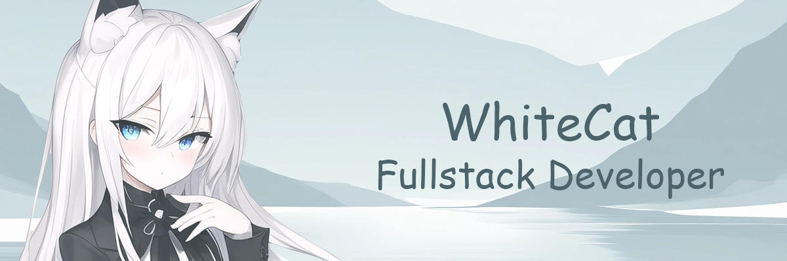

<!-- banner -->

 

<h1></h1>
 

<!-- info -->

    
:memo: About Me:

    

      :wave: Hi there! I'm WhiteCat, I'm a fullstack developer building web applications 
      I mainly use Express and FastAPI for backend development 
      And for frontend development, I use Astro and Vue
        
      Currently, I work as a Fullstack QA Engineer and test web, mobile applications, backends, AI and BigData 
      I'm also developing in the direction of Security testing
        
      Below you can see my stack
    

 

    
:book: Skills:

    

        
         
        
         
        
         
        
    

    <!-- skill issue -->
    <!-- this section will be added to and updated over time -->

 

    
:trophy: Github Stats:

    
     
    
    <!-- I don't know what else I can add here -->

 

<!-- footer -->

<!--

    I'll probably add something here in the future, but for now,  
    I know this section is fine for comments =)

-->
